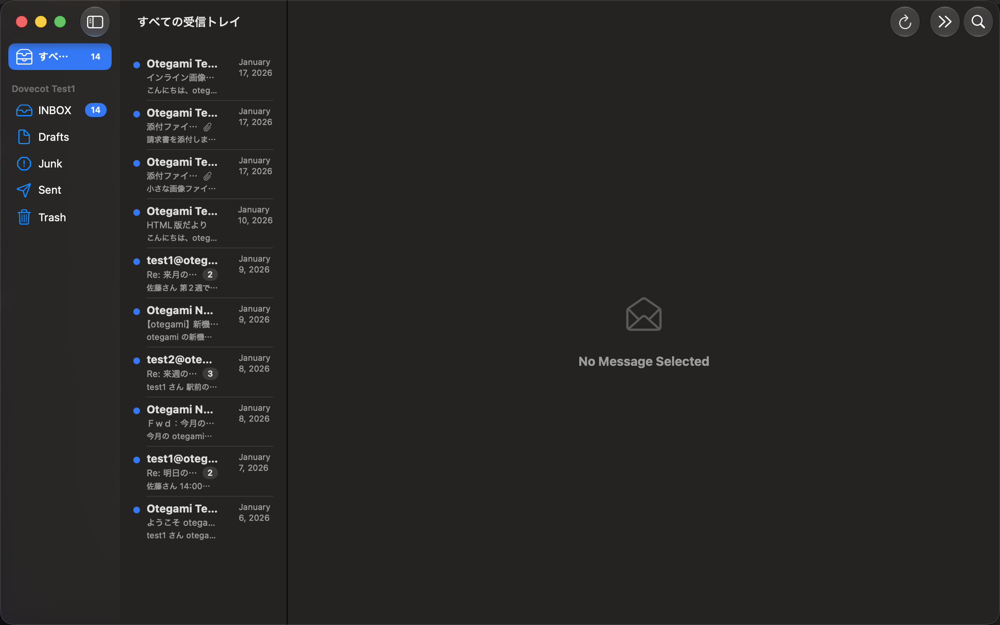
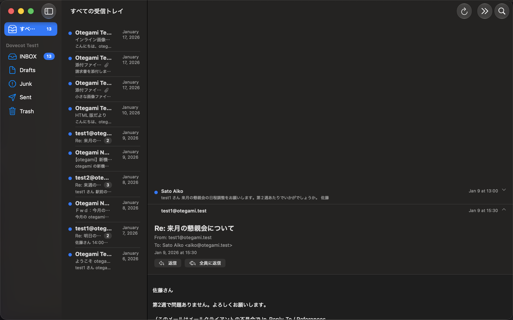

# otegami

An open-source, offline-first mail client for iOS and macOS. Connects to
your existing Gmail, iCloud, or generic IMAP/SMTP account with a single
sync engine, stores everything locally in SQLite (GRDB) with full-text
search, and can optionally run its own self-hosted push notification relay.

<p align="center">
  
  
</p>

## Features

- **Accounts**: Gmail (OAuth2 + PKCE), iCloud (app-specific password), and
  any generic IMAP/SMTP provider — one unified sync engine underneath.
- **Offline-first**: every message, thread, and flag change lives in a
  local SQLite database first; the app is fully usable with no network,
  and reconnects replay a queue of pending changes (read/unread, delete,
  send) once back online.
- **Threading**: Gmail `X-GM-THRID` when available, otherwise a JWZ-style
  `References`/`In-Reply-To` union-find with a subject-based fallback.
- **Unified inbox**: every account's inbox interleaved by date, with
  per-mailbox and unified unread-count badges.
- **Full-text search**: SQLite FTS5 (trigram tokenizer) for 3+ character
  queries, with a `LIKE` fallback for shorter queries — works for Japanese
  and other scripts with no dictionary/segmenter dependency.
- **HTML mail**: rendered in a sandboxed `WKWebView` (JavaScript disabled,
  external images blocked behind a one-tap "show images" banner, inline
  `cid:` images resolved locally).
- **Attachments**: send and receive, with QuickLook preview and inline
  `cid:` image support.
- **Compose/reply**: plain-text quoting, an Outbox for offline sends, and
  local draft saving (save/discard when you close an unsent message).
- **Push notifications**: an optional, self-hostable relay server
  (`server/otegami-relay`) watches your IMAP `INBOX` over IDLE and sends a
  privacy-preserving APNs push (no subject/body on the wire — the app's
  Notification Service Extension fetches the real content itself). Fully
  opt-in; the app works identically without one configured.
- **macOS**: native menu bar commands (⌘N new message, ⌘R reply, ⌘⌫
  delete, ⌘⇧F focus search, ⌘]/⌘[ switch mailboxes), a native Settings
  scene, and its own compose windows.
- **iCloud account sync**: add an account on one device (iOS/macOS, same
  Apple ID) and it appears ready-to-sync on the others — credentials ride
  iCloud Keychain, account metadata syncs via `NSUbiquitousKeyValueStore`;
  see [docs/icloud-sync.md](docs/icloud-sync.md). Opt-out toggle in
  Settings.
- **Performance**: tested against a 100k-message synthetic mailbox — see
  [docs/performance.md](docs/performance.md).

## Status

Feature-complete through milestone M10 (accounts, sync, threading, search,
attachments, compose/reply, push relay, macOS polish, performance work).
Not yet published to the App Store; see [PENDING.md](PENDING.md) for the
handful of steps that require a builder's own credentials (Google OAuth
Client ID, APNs key, etc.) and [docs/roadmap.md](docs/roadmap.md) for
future work.

## Platforms

iOS 26+ and macOS 26+, single SwiftUI codebase (`apps/Otegami`, a
multiplatform Xcode target). Swift 6, strict concurrency throughout.

## Building

This repo uses [XcodeGen](https://github.com/yonaskolb/XcodeGen) to
generate the Xcode project — install it first:

```sh
brew install xcodegen
```

```sh
make mac          # macOS app, debug build (xcodebuild)
make mac-app       # macOS app, Release build bundled to dist/Otegami.app
make ios           # iOS Simulator build (IOS_SIMULATOR ?= "iPhone 17 Pro Max")
make ios-device    # iOS device build, signed with the registered team
make test          # OtegamiKit unit tests (packages/OtegamiKit)
```

Opening `apps/Otegami/Otegami.xcodeproj` in Xcode after `xcodegen generate`
(run automatically by every `make` target above) also works for day-to-day
development.

### Signing

`apps/Otegami/Config/Signing.xcconfig` has a default `DEVELOPMENT_TEAM`.
To build with your own team/bundle ID (required for `make ios-device`,
push notifications, or App Group/Keychain sharing with the Notification
Service Extension), copy `Config/Local.xcconfig.sample` to the untracked
`Config/Local.xcconfig` and override the values there.

### Gmail OAuth

The OSS build ships with no Google OAuth Client ID (it can't be
committed). Without one, the "Gmail" account-type button is disabled but
everything else works. See [docs/oauth-setup.md](docs/oauth-setup.md) to
issue your own (no Google review needed for personal/dev use).

## Development mail stack

A local Dovecot (IMAP) + Mailpit (SMTP + web UI) stack is included, so you
don't need a real mail account to work on sync/send code:

```sh
make mailstack-up     # start Dovecot + Mailpit
make mailstack-seed   # load sample messages (Japanese + English fixtures)
make mailstack-down   # stop the stack
```

Test accounts: `test1@otegami.test` / `test1234` and `test2@otegami.test` /
`test1234` on `localhost:1143` (plain IMAP) / `localhost:1025` (plain
SMTP, via [Mailpit](https://github.com/axllent/mailpit)'s web UI at
`http://localhost:8025`). See [docs/dev-mailstack.md](docs/dev-mailstack.md).

## Testing / verification

```sh
make test                      # OtegamiKit unit tests (fast, no simulator)
scripts/verify-ios-m1.sh       # ...through verify-ios-m9.sh: automated
                                # XCUITest checkpoints per milestone, driven
                                # against the dev mail stack
scripts/verify-relay.sh        # otegami-relay end-to-end (real IMAP IDLE
                                # → push) verification
```

See [docs/verify.md](docs/verify.md) for what each checkpoint covers and
`.claude/skills/verify/SKILL.md` for the automated-verification approach
this project follows (screenshots + XCUITest, judged by an agent, not a
human in the loop).

## Push notification relay (optional)

`server/otegami-relay` is a self-hostable Swift/Hummingbird 2 server that
watches your IMAP `INBOX` over IDLE and forwards new-mail events to APNs.
It never sees your mail's subject or body — only `accountId`/`uidNext`
cross the wire; the app's Notification Service Extension fetches the real
sender/subject itself over your own IMAP connection.

```sh
make server        # build otegami-relay
make server-test    # run its test suite
make relay-docker   # build the Docker image
```

See [docs/relay-deployment.md](docs/relay-deployment.md) for deployment
(Docker Compose, APNs `.p8` key, HTTPS termination) and the app-side
opt-in flow.

## Architecture

- `apps/Otegami/` — the SwiftUI app (iOS + macOS), XcodeGen `project.yml`.
- `packages/OtegamiKit/` — a Swift package with the platform-independent
  core: `OtegamiCore` (models, threading), `MailTransport` (protocol
  abstraction over IMAP/SMTP), `MailTransportMailCore` (the MailCore2
  adapter), `OtegamiStore` (GRDB schema/queries/FTS), `SyncEngine` (sync
  coordination, offline op queue), `GoogleOAuth`, `PushRelayClient`,
  `OtegamiRelayAPI` (DTOs shared with the server).
- `server/otegami-relay/` — the push relay (Hummingbird 2, Linux-friendly).
- `dev/mailstack/` — the Dovecot + Mailpit dev stack.

See [docs/build-mailcore2.md](docs/build-mailcore2.md) for how the
MailCore2 dependency is vendored, and [docs/performance.md](docs/performance.md)
for the 100k-message performance pass (query indexes, pagination, measured
numbers).

## License

MIT — see [LICENSE](LICENSE).
