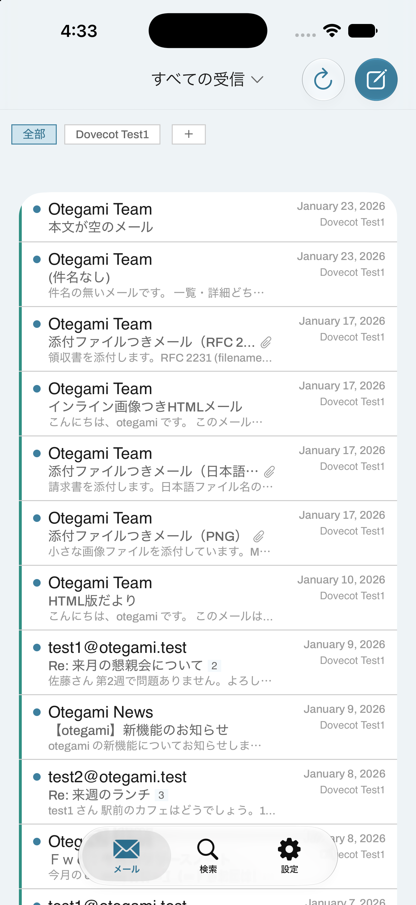
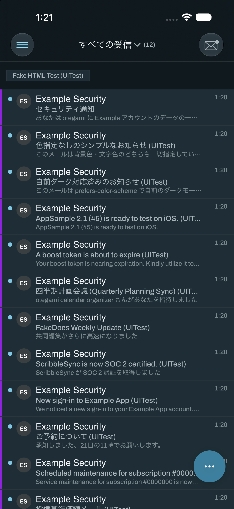
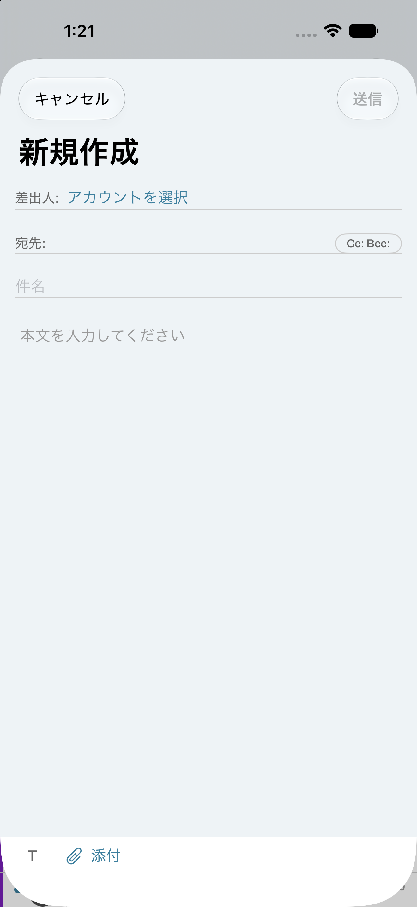
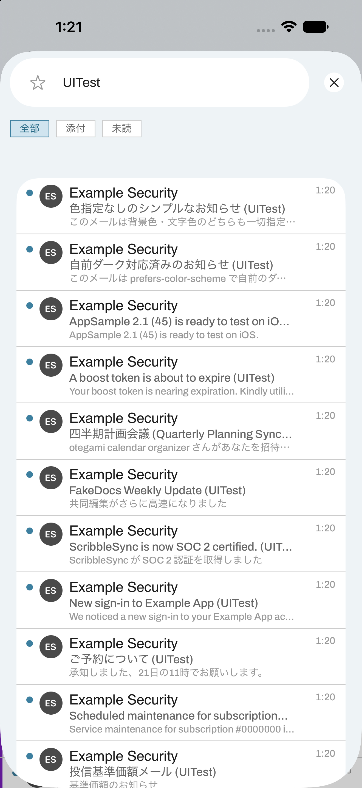
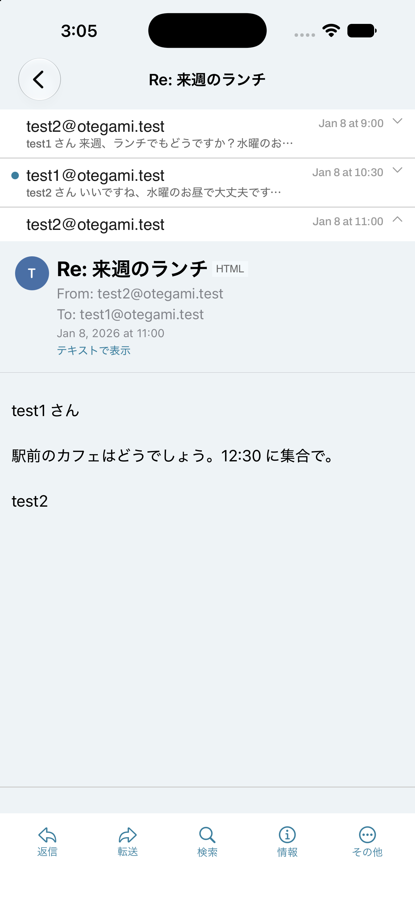
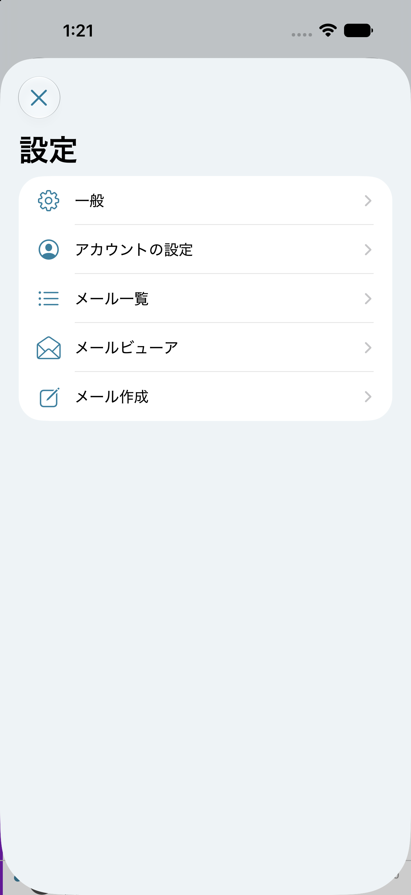

# otegami

[](https://github.com/m-tkg/otegami/actions/workflows/ci-app.yml)
[](https://github.com/m-tkg/otegami/actions/workflows/ci-server.yml)

**[English README is here](README.md)**

オフラインファーストな iOS/macOS 向けメールクライアント（オープンソース）。
Gmail・iCloud・任意の IMAP/SMTP アカウントに1つの同期エンジンで接続し、
すべてのデータをローカルの SQLite (GRDB) に保存して全文検索でき、英文メール
は端末内で翻訳でき、プッシュ通知用のリレーサーバーもセルフホストできます。

> **ステータス: 開発中・実験的段階。** 実際のメールで使う前に下記の
> [ステータス](#ステータス) を確認してください。

<p align="center">
  
  
  
</p>
<p align="center">
  
  
</p>

## otegami の特徴

個別の機能一覧より先に、このアプリが軸にしている2点を挙げます。

1. **複数アカウントを1つの受信トレイで。** Gmail・iCloud・任意の IMAP/SMTP
   アカウントが同じ同期エンジンの上で動き、1つの統合受信トレイに日付順で
   混ざって並びます。タップ1つで特定アカウントだけに絞り込めます。
2. **端末内翻訳。** 英文メールは Apple の Foundation Models framework に
   よって完全にオンデバイスで日本語に翻訳されます（返信も同様に英訳可能）。
   サーバーへの通信は一切発生せず、外部の翻訳 API にメール内容が渡ることも
   ありません。詳細は下記の[翻訳機能](#翻訳機能)を参照してください。

## 機能

- **アカウント**: Gmail (OAuth2 + PKCE)、iCloud (App 用パスワード)、任意の
  汎用 IMAP/SMTP プロバイダ — すべて同じ同期エンジンの上で動きます。
- **オフラインファースト**: メッセージ・スレッド・フラグの変更はすべて
  まずローカルの SQLite に反映されます。ネットワークが無くても普通に使え、
  再接続時には未送信の操作（既読/未読、削除、アーカイブ、送信）のキューが
  自動的にリプレイされます。アーカイブはプロバイダごとの挙動を考慮:
  Gmail には実体としての「アーカイブ」フォルダが無いため、送信元メール
  ボックスからラベルを外すだけの操作になります（Gmail 側が「すべての
  メール」に自動的に残します）。それ以外のプロバイダでは Archive
  メールボックスへ移動（無ければ自動作成）します。
- **端末内翻訳 + AI要約** (Apple Foundation Models、iOS/macOS 26+):
  メールの検出言語がアプリの表示言語と異なるときにインラインの翻訳バー
  が表示され、既定では訳文を表示（原文への切替はワンタップ）。段落を
  長押しすればその段落だけ原文を確認できます。「AI要約」バーは言語を
  問わずどのメッセージにも表示され、タップで端末内生成の短い要約を
  表示します。「英語で返信を下書き」で英訳前提のまま返信作成に入れる
  こともできます。自動翻訳は設定でオフにできます。データは一切端末の
  外に出ません — エンジンの設計と唯一知られている Simulator 固有の制限
  は [`docs/translation.md`](docs/translation.md) を参照してください。
  翻訳自体は実機相当のオンデバイスモデルに対して毎回2〜5秒で成功する
  ことを確認済みです。
- **スレッド化**: Gmail では `X-GM-THRID` を利用し、それが無い場合は
  `References`/`In-Reply-To` による JWZ 方式の union-find + 件名フォール
  バックで解決します。バッチ化により大量メッセージの一括スレッド化も高速
  です（10万通規模で約1.4秒、[docs/performance.md](docs/performance.md)
  参照）。
- **アカウント絞り込みチップつき統合受信トレイ**: 全アカウントのメールを
  日付順に混ぜて表示する「全部」チップと、アカウントごとの絞り込みチップ。
  アカウント色のアクセントと、メールボックス単位/統合の未読数バッジ。各
  アカウントの色はアカウント ID から自動決定されますが、そのアカウントの
  編集画面から固定8色パレットの中で上書きも可能（変更は他の接続設定と
  同様 iCloud 経由で端末間に同期されます）。
- **アプリアイコンの未読バッジ**: 統合受信トレイの未読数をアプリアイコン
  に表示します（既定 ON、設定でオフ可能）。アプリ内の未読数表示と同じ
  同期/観測の仕組みで常に最新に保たれ、プッシュ通知受信時は即座に+1し、
  次の同期で正しい数へ自己修正します。
- **全文検索**: SQLite FTS5 (trigram トークナイザ) による3文字以上の
  クエリ検索、それより短いクエリは `LIKE` にフォールバック — 辞書や
  セグメンタ無しで日本語を含む多言語に対応します。フィルタチップ
  （添付・未読・英語）と「人」「メール」でのセクション分けにも対応。
- **HTML メール**: サンドボックス化された `WKWebView` で描画（JavaScript
  は無効 — `<script>` によるDOM書き換え・`onerror`ハンドラ・`iframe`・
  `javascript:` リンクなど実際の攻撃手法を含むメールで再検証済み、いずれも
  無害化されることを確認）。詳細画面には控えめな「HTML」バッジが付き、
  ワンタップでテキスト表示に切り替え可能（設定の「常にテキストで表示」で
  既定を変更することも可能）。本文が完全に空のメールは、空欄のままではなく
  薄い文字で「本文なし」と表示。埋め込み画像（インライン `cid:` 画像・
  画像添付）は既定オフ、リモート画像は既定オンで設定画面に開封トラッキング
  についての注意書きを表示。どちらも「画像を表示」バナーでメールごとに
  一時的に上書き可能。本文内のリンクはアプリ内ブラウザ（既定、iOS のみ）
  かデフォルトブラウザかを設定で選択可能。
- **添付ファイル**: 送受信・QuickLook プレビュー・インライン `cid:` 画像
  に対応し、RFC 2047/2231 のファイル名デコード（日本語ファイル名を含む）
  にも対応しています。
- **作成/返信**: 誤送信防止のための差出人選択必須、プレーンテキストでの
  引用、オフライン送信用の Outbox、両プラットフォームでの下書き保存/破棄
  確認、IMAP 経由の下書き双方向同期。添付 (ファイル・写真・実機のみ
  カメラ撮影) は1つの「添付」メニューにまとまっています。iOS では送信も
  消失防止・取り消し
  可能: 「送信」を押した瞬間にローカルの Outbox へ確定保存されるため
  （アプリが強制終了してもメールは消えません）、設定可能な 5秒/10秒/
  なし の猶予の間、「送信を取り消す」ボタンつきのカウントダウンバーで
  保留されます。アプリを離れると即座に送信が確定します。詳細は
  [docs/settings.md](docs/settings.md)。
- **テンプレート**: 設定画面で管理する再利用可能な定型文。任意で特定の
  アカウント専用に設定可能（未指定ならすべてのアカウントで使用可能）。
  作成画面の「テンプレートを挿入」メニューから呼び出せる — 件名・本文が
  空の新規作成では両方を置き換え、それ以外では本文の末尾に追記（署名的な
  使い方）。
- **署名テンプレート**: 上記のテンプレートとは別機能 — 1つの署名を複数の
  アカウントに割り当てられ、アカウントごとにデフォルト署名を設定すると
  新規メール作成時に自動で本文末尾へ挿入されます（返信・転送では自動
  挿入しません。既存の引用本文プリフィルとの競合を避けるため）。設定 →
  「署名テンプレート」で管理し、作成画面の「署名」欄からいつでも手動で
  切替・解除できます（切替時は直前に挿入した分だけを正確に取り除いて
  差し替えます）。
- **デフォルトの送信アカウント**: 新規メール作成時に Composer が既定で
  選ぶ差出人アカウントを、設定 →「アカウントの設定」で選べます（返信・
  転送はこの設定に関わらず元のメッセージのアカウントを使用）。
- **削除/アーカイブ後の挙動を設定可能**: メール本文画面の「…」メニュー
  から削除・アーカイブ・迷惑メールにする操作をしたあと、一覧に戻るか
  （既定）現在の並び順で次のメールを自動で開くかを、設定 →「メール
  ビューア」で選べます。
- **スワイプ操作と一括選択**: 左右それぞれのスワイプに短い/長いスワイプ
  を個別設定可能（既読/未読切替・アーカイブ・迷惑メールにする・ピン留め・
  削除）。誤操作防止のため削除・迷惑メールは常にタップ確定、長押しでの
  一括選択モードと下部アクションバー、削除/アーカイブ/迷惑メールの Undo
  トースト。macOS はスワイプが無いため、同じ操作を行の右クリックメニュー
  から使えます。
- **ピン留め**: メール/スレッドをピン留めすると一覧の最上位に固定されます。
  既定ではこの端末だけのローカルな印ですが、設定で IMAP の `\Flagged`
  フラグと連動させ、他クライアントとも同期できます。
- **一覧表示**: カード状の行（輪郭線は描かず、角丸+面の色だけで区切る
  カード）を統合受信トレイ・メールボックス別・検索結果のすべてで採用。
  日時表示は一般的なメールアプリの慣習に沿い、今日のメールは時刻のみ、
  それ以外は日付+時刻。スレッド表示のオン/オフ（オフにすると1メール1行
  のフラット表示）、差出人のイニシャル + アカウント色によるアイコン
  （一覧・詳細どちらにも表示可能、外部サービスへの問い合わせは一切な
  し）、本文プレビューの行数設定に対応。スレッドを開いた時の折りたたみ
  行にも同じアイコン/プレビューを表示しますが、トップの一覧と見分けが
  つくよう控えめなトーンで区別しています。
- **スレッド詳細は厳密なアコーディオン**: 常に1通だけ展開され、別の
  メッセージのヘッダをタップするとそれが開き他は畳まれます。展開中の
  メッセージはアクセントカラーの縦罫線 (一覧のアカウント色罫線と同じ
  見た目) で視覚的に強調され、本文画面下部のツールバー（返信・転送・
  検索・情報）は常にその展開中のメッセージを対象にします。
- **表示言語**: 設定で「システムに従う」「日本語」「English」を選べます。
  アプリ UI の大部分（一覧・本文・作成・検索・ハンバーガーメニュー・
  アカウント追加/編集フォームやテンプレート・署名・プッシュ通知を含む
  設定の各画面）が String Catalog によりローカライズされています。
  反映にはアプリの完全終了→再起動が必要（ホーム画面に戻るだけでは
  不十分）で、言語を選んだ直後に表示される確認アラートの「今すぐ終了」
  から即座にアプリを終了できます。詳細は
  [docs/localization.md](docs/localization.md)。
- **設定画面を5カテゴリに再構成**: アカウントの設定（追加削除・デフォルト
  アカウント）、メールビューア（リンクを開く方法・削除/アーカイブ後の
  挙動・AI機能 on/off）、メール一覧（プロフィール画像・プレビュー行数・
  スワイプ設定）、署名テンプレート、その他（スレッド表示・ピン留め・
  送信キャンセル・画像・HTML表示・表示言語・テンプレート・iCloud同期・
  プッシュ通知・アイコンバッジ・このアプリについて）。iOS（ハンバーガー
  メニュー→設定）・macOS（ネイティブ Settings シーン）共通の構成です。
- **プッシュ通知**: 任意でセルフホストできるリレーサーバー
  (`server/otegami-relay`) が IMAP `INBOX` を IDLE で監視し、プライバシー
  に配慮した APNs プッシュを送信します（件名/本文はワイヤーに乗らず、
  アプリの Notification Service Extension が自分で内容を取得します）。
  完全にオプトインで、設定していなくてもアプリは同様に動作します。
  **実機の iPhone でエンドツーエンドの動作を確認済み** — 実 APNs 経由の
  配信、Notification Service Extension による差出人/件名の正しい書き換え、
  無効化時のきれいな後始末まで検証しています。詳細は
  [`docs/relay-deployment.md`](docs/relay-deployment.md) を参照。
- **macOS**: ネイティブなメニューバーコマンド（⌘N 新規、⌘R 返信、⌘⌫
  削除、⌘⇧F 検索フォーカス、⌘]/⌘[ メールボックス切替）、ネイティブな
  Settings シーン、独立した作成ウィンドウ（iOS と同じ保存/破棄確認が、
  タイトルバーの閉じるボタンから閉じた場合にも効きます）、そして従来
  通りの3ペイン `NavigationSplitView` レイアウト。
- **iCloud アカウント同期**: 同じ Apple ID の別デバイス（iOS/macOS）で
  追加したアカウントが自動的に出現し、そのまま同期を始められます。
  資格情報は iCloud キーチェーン経由、アカウントのメタデータ（編集も
  含む）は `NSUbiquitousKeyValueStore` 経由で同期されます。詳細は
  [docs/icloud-sync.md](docs/icloud-sync.md)。設定でオプトアウト可能。
  アカウントの同一性は内部 ID だけでなくメールアドレス/IMAP ホスト/
  ユーザー名でも判定するため、2台のデバイスが同じメールアカウントを
  独立に追加しても重複挿入されません。修正前に重複が発生していた端末も、
  次回起動時にメール・下書き・テンプレートを一切失うことなく自動的に
  1つに統合されます。その統合で万一資格情報を持たない側が生き残って
  しまった場合（例: パスワードが統合済みの元アカウントの下で Keychain に
  孤立してしまった場合）も、どのアカウントに対応するか一意に判断できる
  範囲で自動的に付け替えます。
- **パフォーマンス**: 10万通の合成メールボックスで検証済み — 詳細は
  [docs/performance.md](docs/performance.md)。

## デザイン

UI は一から見直した独自のデザインを採用しています（元のワイヤーフレーム
の選択肢は
[`design_handoff_ios_mail/README.md`](design_handoff_ios_mail/README.md)、
結果として確定したトークン体系は
[`docs/design-system.md`](docs/design-system.md) を参照）: フラット・
角丸0・2pt の罫線、英字は Archivo・日本語はシステムフォント、薄い水色
基調のライトテーマとそれに対応するダークテーマ。iOS は統合受信トレイ＋
アカウント絞り込みチップの常設1画面＋左上のハンバーガーメニュー
（フォルダ切替と設定）＋ヘッダの検索ボタン（アカウント絞り込みチップ・
`from:`/`to:`/`cc:`/`subject:` 検索演算子・検索履歴を備えた検索画面）＋
メール本文画面下部の固定ツールバー（返信/転送/差出人で絞り込む検索/
メール情報/その他 — ミュート・ピン留め・アーカイブ・迷惑メール・削除・
ツールバーの並び替え）という構成、macOS は画面の広さに対してコンパクト
向けレイアウトが合わないため、従来通りの3ペイン `NavigationSplitView`
を維持しています。コンポーネント/トークンの全体像は
[`docs/design-system.md`](docs/design-system.md) にまとめてあります。

<p align="center">
  
  
  
</p>

## 翻訳機能

otegami は Apple の Foundation Models framework (`LanguageModelSession`)
を使い、英文メールを完全に端末内で日本語に翻訳します。Apple Intelligence
の裏側にあるのと同じオンデバイスモデルを使うため、メールの内容が翻訳
API やサーバーに送信されることは一切ありません。主な特徴:

- メッセージごとの翻訳バー。既定は訳文表示で、セグメントコントロールで
  原文に切り替えられ、段落を長押しすればその段落だけ原文を確認できます。
- 「英語で返信を下書き」で英訳前提のまま返信作成画面を開くと、自分が
  書いた下書きをその場で英訳します（送信前に結果を確認・編集できる設計
  で、裏で黙って翻訳されることはありません）。**この入口が唯一の手段**
  です — 以前はどの作成画面からも手動でON/OFFできる汎用の「英語に翻訳
  して送る」トグルがありましたが、この特定の入口に一本化する形で削除
  しました。
- エンジン識別子をキーにした段落単位のキャッシュにより、一度翻訳した
  メッセージを開き直しても再翻訳が走りません。
- iOS/macOS 26+ かつ Apple Intelligence が有効な端末が必要です。非対応
  の端末/OS では翻訳 UI が自動的に折りたたまれ、それ以外の動作には
  影響しません。

エンジンの設計、対応23言語、コンテキストサイズの制限、そして唯一知られ
ている制限（iOS Simulator のサンドボックス化された `.app` プロセスから
呼び出すと `FoundationModels.LanguageModelError -1` で一貫して失敗する
一方、同一マシン上の素の `swift test` プロセスからは毎回成功する —
これはコードの不具合ではなく Simulator/toolchain 固有の制限とみられ、
実機での最終確認が [PENDING.md](PENDING.md) に残っています）は
[`docs/translation.md`](docs/translation.md) にまとめています。

## ステータス

M11 のマイルストーンまで（アカウント・同期・スレッド化・検索・添付・
作成/返信/下書き・プッシュリレー・iCloud アカウント同期・macOS の作り
込み・性能対応）に加え、デザインの全面刷新と端末内翻訳を実装済みで、
自動テスト/検証スイート (`make test`、`scripts/verify-*.sh` の各チェック
ポイント) はすべて green です。プッシュ通知は実機の iPhone に対して
エンドツーエンドで検証済み（セルフホストしたリレー経由の実 APNs 配信）。
とはいえこれは個人が AI の支援を受けて開発しているサイドプロジェクトで
あり、App Store に公開したことも、誰かの日常のメインクライアントとして
長期間使われたこともまだありません。実験的なものとして扱ってください:

- 一部の項目はまだ単体テスト・モック・ローカルの dev mailstack・単一の
  シミュレータでのみ検証済みで、実アカウント/実機での確認が済んでいま
  せん: 実 Gmail/iCloud アカウントでのサインインからの一連の動作、実機
  2台間での iCloud アカウント同期の往復、iOS Simulator のアプリ UI を
  通した端末内翻訳（同一マシン上の素のプロセスからは成功します。上記
  [翻訳機能](#翻訳機能)参照）。何が未検証で、なぜで、自分の資格情報/
  デバイスでどう確認すればよいかは [PENDING.md](PENDING.md) に詳細を
  まとめています — 同じ内容を「今日やることリスト」の形に並べ替えた
  ものが [HUMAN_TASKS.md](HUMAN_TASKS.md) です。
- 今後の計画は [docs/roadmap.md](docs/roadmap.md) を参照してください。

## 対応プラットフォーム

iOS 26+ / macOS 26+、単一の SwiftUI コードベース (`apps/Otegami`、
マルチプラットフォーム Xcode ターゲット)。Swift 6、strict concurrency。

## ビルド方法

iOS 26 / macOS 26 SDK を含む Xcode (Xcode 26 以降) と、Xcode プロジェクト
を生成する [XcodeGen](https://github.com/yonaskolb/XcodeGen) が必要です
(先に XcodeGen をインストールしてください):

```sh
brew install xcodegen
```

```sh
make mac          # macOS アプリ、debug ビルド (xcodebuild)
make mac-app       # macOS アプリ、Release ビルドを dist/Otegami.app に生成
make ios           # iOS Simulator ビルド (IOS_SIMULATOR ?= "iPhone 17 Pro Max")
make ios-device    # 登録済みチームで署名した iOS 実機ビルド
make test          # OtegamiKit の単体テスト (packages/OtegamiKit)
```

`xcodegen generate` (上記の各 `make` ターゲットが自動実行) の後、
`apps/Otegami/Otegami.xcodeproj` を Xcode で直接開いて日常的な開発を
進めることもできます。

### 署名について

`apps/Otegami/Config/Signing.xcconfig` には `DEVELOPMENT_TEAM` を含めて
いません（OSS リポジトリに作者個人の値をコミットできないため）。
`make ios` (Simulator) と `make mac` はこのままでもビルドできます —
Simulator は provisioning を要求せず、`make mac` は `Local.xcconfig` が
無い場合 CI と同様に未署名ビルドにフォールバックします。`make ios-device`
（実機）、完全に署名された `make mac`（Notification Service Extension
との App Group/Keychain 共有を実際に機能させる場合）、プッシュ通知を
使う場合は、`Config/Local.xcconfig.sample` を `Config/Local.xcconfig`
（git 管理外）にコピーし、自分の `DEVELOPMENT_TEAM` を設定してください。
既定の `com.mtkg.otegami` が別のチームで既に App ID として登録済みの
場合のみ (Apple は同じ explicit App ID を2つのチームに登録することを
許可していません) `OTEGAMI_BUNDLE_ID` も上書きする必要があります —
詳細は `Config/Local.xcconfig.sample` のコメントを参照してください。

### Gmail OAuth

OSS ビルドには Google OAuth Client ID を含めていません（コミットできない
ため）。未設定の場合、「Gmail」のアカウント種別ボタンは無効化されますが
それ以外は問題なく動作します。自分の Client ID を発行する手順（個人利用
であれば Google の審査は不要）は [docs/oauth-setup.md](docs/oauth-setup.md)
を参照してください。

## 開発用メールスタック

実アカウント無しで同期/送信まわりを開発できるよう、Dovecot (IMAP) +
Mailpit (SMTP + Web UI) のローカルスタックを同梱しています (Docker
Compose を使うので、先に [Docker Desktop](https://www.docker.com/products/docker-desktop/)
などをインストールしてください):

```sh
make mailstack-up     # Dovecot + Mailpit を起動
make mailstack-seed   # サンプルメール (日本語・英語フィクスチャ) を投入
make mailstack-down   # スタックを停止
```

テストアカウント: `test1@otegami.test` / `test1234` と
`test2@otegami.test` / `test1234`、`localhost:1143` (平文 IMAP) /
`localhost:1025` (平文 SMTP、[Mailpit](https://github.com/axllent/mailpit)
の Web UI は `http://localhost:8025`)。詳細は
[docs/dev-mailstack.md](docs/dev-mailstack.md)。

## テスト/動作検証

```sh
make test                      # OtegamiKit の単体テスト (速い、simulator 不要)
scripts/verify-ios-m1.sh       # 〜verify-ios-m9.sh に加え、
                                # verify-ios-icloud.sh / -account-edit.sh /
                                # -drafts-sync.sh / -push-simulated.sh /
                                # verify-macos-qa.sh / verify-qa-sweep-offline.sh
                                # など、マイルストーン/機能ごとの自動
                                # XCUITest 検証 (dev mailstack を対象に実行)
scripts/verify-relay.sh        # otegami-relay のエンドツーエンド検証
                                # (実 IMAP IDLE → push)
```

各チェックポイントの内容は [docs/verify.md](docs/verify.md)、このプロ
ジェクトの自動検証の方針（スクリーンショット + XCUITest を、人間ではなく
エージェントが判定する）は `.claude/skills/verify/SKILL.md` を参照して
ください。

## プッシュ通知リレー (任意)

`server/otegami-relay` は、IMAP `INBOX` を IDLE で監視し新着メールの
イベントを APNs へ転送する、セルフホスト可能な Swift/Hummingbird 2 製
サーバーです。件名/本文は一切扱わず、ワイヤーに乗るのは `accountId`/
`uidNext` のみ — 実際の差出人/件名はアプリの Notification Service
Extension が自分の IMAP 接続で取得します。

```sh
make server        # otegami-relay をビルド
make server-test    # テストスイートを実行
make relay-docker   # Docker イメージをビルド
```

デプロイ手順 (Docker Compose、APNs `.p8` キー、HTTPS 終端、プライベート
CA を使った宅内サーバーでの運用例を含む) とアプリ側のオプトインフローは
[docs/relay-deployment.md](docs/relay-deployment.md) を参照してください。

`make deploy-ota` は Ad Hoc 版の `.ipa` をビルドし、自前の reverse proxy
経由で登録済み端末に OTA インストールできる形で公開します。詳細は
[docs/ota-deploy.md](docs/ota-deploy.md) を参照してください。

## アーキテクチャ

- `apps/Otegami/` — SwiftUI アプリ本体 (iOS + macOS)、XcodeGen
  `project.yml`。
- `packages/OtegamiKit/` — プラットフォーム非依存のコアを持つ Swift
  package: `OtegamiCore` (モデル・スレッド化)、`MailTransport`
  (IMAP/SMTP のプロトコル抽象化)、`MailTransportMailCore` (MailCore2
  アダプタ)、`OtegamiStore` (GRDB スキーマ/クエリ/FTS)、`SyncEngine`
  (同期の調整・オフライン操作キュー)、`GoogleOAuth`、`PushRelayClient`、
  `OtegamiRelayAPI` (サーバーと共有する DTO)、`OtegamiTranslation` /
  `OtegamiTranslationFoundationModels` / `TranslationEngine` (端末内
  翻訳のスタック — プロトコル・Apple 実装・キャッシュ/オーケストレー
  ション層を分離し、サーバーや非 Apple ターゲットが `FoundationModels`
  を巻き込まないようにしています)。
- `server/otegami-relay/` — プッシュリレー (Hummingbird 2、Linux 対応)。
- `dev/mailstack/` — Dovecot + Mailpit の開発用スタック。

MailCore2 依存の同梱方法は [docs/build-mailcore2.md](docs/build-mailcore2.md)、
10万通規模の性能検証 (クエリインデックス・ページネーション・実測値) は
[docs/performance.md](docs/performance.md) を参照してください。

## 貢献

Issue・Pull Request を歓迎します — バグ報告・質問・小さな修正は特に
歓迎です。開発環境のセットアップ・テストの実行方法・コミット/PR の
規約は [CONTRIBUTING.md](CONTRIBUTING.md) を参照してください。セキュ
リティ上の脆弱性は公開の Issue ではなく [SECURITY.md](SECURITY.md) の
手順で報告してください。

## ライセンス

MIT — [LICENSE](LICENSE) を参照。

### サードパーティライセンス

Otegami は Swift Package Manager 経由でいくつかのサードパーティ製
オープンソースパッケージに依存しており (GRDB.swift、MailCore2 の
フォークとその C 依存関係、Hummingbird、SwiftNIO、swift-crypto 等)、
Archivo フォント (SIL Open Font License) も同梱しています — 一覧・
ライセンス種別・著作権表示は [NOTICE](NOTICE) を参照してください。
